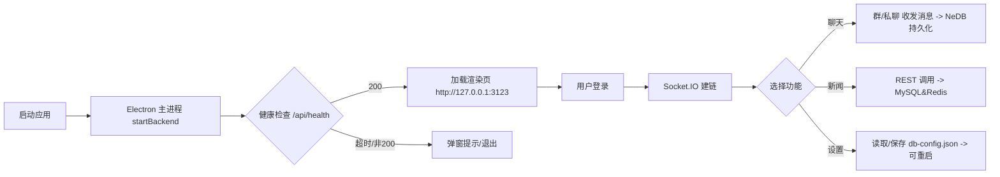
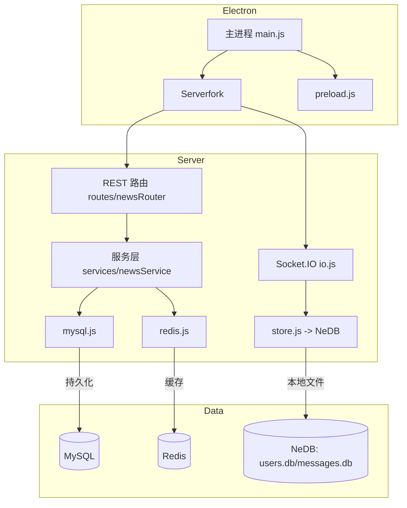
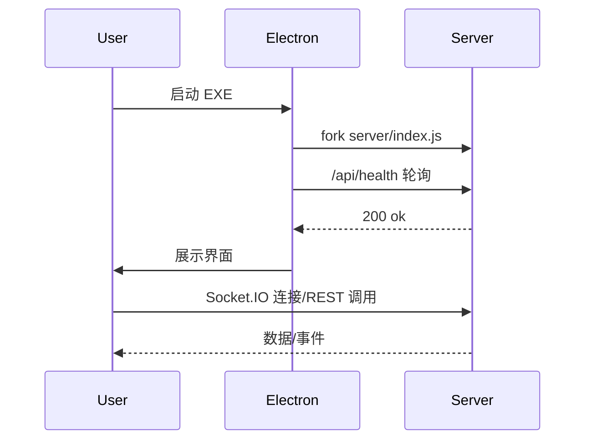

# 聊天与新闻桌面应用 软件设计说明书

版本：1.1.0  日期：2025-11-10  作者：谭玉庭

---

> 说明：本说明书在仓库 `docs/概要设计说明书.md` 中维护，已经根据当前代码自动抽取了主要模块、接口与数据结构，并补充了表格、流程图与结构图，便于评审与交付。

##  引言

###  编写目的
本说明书用于对“聊天与新闻桌面应用（MyChat）”的总体方案、接口、运行与数据设计做出统一说明，帮助读者把握系统结构、关键流程与约束，为详细设计、实现与测试提供依据。

预期读者：课程指导教师、评审专家、项目开发与测试人员、运维同学。

### 背景

| 项目要素 | 说明 |
| --- | --- |
| 系统名称 | MyChat（Electron + Vue2 + Node.js 后端） |
| 任务提出者 | 数据库课程设计项目组 |
| 开发者 | @tenz 及课程小组 |
| 主要用户 | 课堂示范、评测人员与同学 |
| 运行场所 | Windows 10/11 PC |
| 运行方式 | Electron 桌面端，内置 Node/Express 服务，前端为 Vue2 |

### 定义

| 术语 | 定义 |
| --- | --- |
| Electron | 基于 Chromium 与 Node 的桌面框架 |
| Main/Renderer | Electron 主进程 / 渲染进程 |
| IPC | 进程间通信（inter-process communication） |
| REST API | 基于 HTTP 的接口风格 |
| Redis | 内存键值数据库（本项目用于缓存） |
| NeDB | 嵌入式文件数据库，存储聊天用户/消息历史 |
| MySQL | 关系数据库，承载新闻模块业务数据 |
| ASAR | Electron 打包的只读归档格式 |

### 参考资料

- 项目源码与文档：docs/、db/、server/；
- 第三方：Electron、Vue CLI 4、Express、mysql2、ioredis、socket.io、nedb；
- 规范：REST 设计规范、SQL 约束规范、语义化版本规范；
- 部署：electron-builder（NSIS 安装器）；
- 详细表结构见 `db/news_schema.sql`。

---

## 2 总体设计

### 需求规定（概要）

系统围绕“聊天为主、新闻为辅”的教学演示场景展开：聊天子系统强调本地可用与即时可见，哪怕外部数据库暂不可达也能完成消息收发与历史留存；新闻子系统承载较完整的数据建模与查询性能实践，配合缓存展示一套可复现实验路径。下表仅对主要模块与约束做一个结构化归纳。

| 模块 | 主要功能 | 关键约束 |
| --- | --- | --- |
| 聊天 | 登录、群聊/私聊、历史记录、图片与文件消息、在线用户、提示音 | 本地 NeDB 持久化；Socket.IO 实时通信 |
| 新闻 | 列表/详情、分类、热门/近期、评论、后台管理（root）、备份/还原/重置/种子数据 | MySQL 存储、Redis 缓存、后台操作有权限限制 |
| 配置 | UI 修改 MySQL/Redis/上传限制并保存到 `db-config.json`，可一键重启 | 保存需校验字段类型与范围 |
| 上传 | 图片/文件上传，限制扩展名、MIME、大小 | Multer 控制大小，白名单扩展与 MIME |
| 健康 | `/api/health` 返回服务状态与 MySQL/Redis 子系统状态 | 供 Electron 主进程健康检查 |

###  运行环境

为确保课堂与评审现场的可复现性，项目在 Windows 10/11 的常见教学机房即可运行。开发阶段建议使用 Node 18 及以上版本以获得更好的依赖兼容性；正式运行时由 Electron 自带的 Node 版本托管后端服务。默认服务监听 3123 端口，所有业务数据、上传文件与日志均落在用户目录下的专属数据根目录，以避免 Program Files 等受限路径导致的写入失败。

| 类别 | 要求 |
| --- | --- |
| 硬件/OS | Windows 10/11 x64 |
| Node/Electron | 开发 Node 18+；运行 Electron 30 |
| 端口 | 默认 3123（可通过 `PORT` 覆盖） |
| 数据目录 | `%APPDATA%/MyChat/`：`data/`（NeDB）、`upload/`（文件）、`logs/`（日志）、`config/db-config.json`（配置） |

###  基本设计概念与处理流程（流程图）

###  结构（分层与模块）

主要文件职责一览：

| 路径 | 职责 |
| --- | --- |
| `electron/main.js` | 启动/健康检查/窗口管理/日志收集 |
| `server/index.js` | Express 装配、静态/上传、健康、配置 API |
| `server/io.js` | Socket.IO 事件、用户管理、消息广播、历史加载 |
| `server/services/newsService.js` | 新闻 CRUD、统计、备份/还原/重置/种子数据 |
| `server/mysql.js` | mysql2 连接池，带容错状态上报 |
| `server/redis.js` | ioredis 客户端与降级无操作客户端 |
| `server/config.js` | `db-config.json` 读取/校验/写入 |
| `server/store.js` | NeDB 持久化用户与消息 |

###  功能需求与程序关系（矩阵）

从实现角度看，系统将“界面交互”“即时通信”“领域服务”与“基础设施”清晰分离：渲染进程负责呈现与输入，Socket.IO 承担实时链路，Express 路由把 REST 请求路由至服务层，服务层再与 MySQL、Redis 与本地 NeDB 协同工作。下面的矩阵帮助定位每个功能落在哪些代码单元上，从而便于阅读与测试覆盖。

| 功能需求 | server/index.js | server/io.js | services/newsService.js | routes/newsRouter.js | mysql/redis | store(NeDB) | renderer(Vue) |
| --- | --- | --- | --- | --- | --- | --- | --- |
| 登录/聊天 |  | √ |  |  |  | √ | √ |
| 历史消息 |  | √ |  |  |  | √ | √ |
| 新闻列表/详情 |  |  | √ | √ | √ |  | √ |
| 评论 |  |  | √ | √ | √ |  | √ |
| 热门/近期 |  |  | √ | √ | √ |  | √ |
| 上传文件 | √ |  |  |  |  |  | √ |
| 健康检查 | √ |  |  |  |  |  | √ |
| 配置读写 | √ |  |  |  |  |  | √ |

###  人工处理过程
在首次部署或更换数据库环境时，一般需要先准备好 MySQL 与 Redis，并将 `db/news_schema.sql` 中的结构脚本导入到目标库中。随后在应用的“设置”页面录入数据库连接参数并保存，应用会提示重启以让配置生效。出于安全考虑，只有以 root 身份登录时才会在“新闻中心”的管理面板看到备份、还原、重置与初始化种子数据等运维按钮，普通用户不会暴露此能力。

###  尚未解决的问题
当前版本在易用性与工程化方面仍留有改进空间，例如对异常场景的重试与提示文案还有优化余地；备份文件尚未引入加密与签名机制，恢复流程缺少完整校验；安装包没有启用自动更新与代码签名；权限模型也只区分普通用户与 root 两级，尚未覆盖更细粒度的审计需求。这些项都已被记录为后续增量迭代的候选。

---

## 3 接口设计

###  用户接口（主要交互）

应用遵循“先可用后完善”的交互原则：用户启动程序后先进入会话页，完成昵称登录即可开始群聊；如需浏览新闻，可直接切换到新闻页进行检索与筛选；当数据库连接信息需要调整时，可在设置页打开对话框修改并保存，系统会以明确的提示引导一次快速重启；而具备 root 身份的用户，在进入新闻中心时会额外看到一组面向维护的按钮，用于备份、还原、重置与初始化种子数据。

| 功能 | 入口 | 主要操作 | 结果反馈 |
| --- | --- | --- | --- |
| 登录 | 会话页 | 输入昵称/登录 | 登录成功并进入群聊 |
| 群/私聊 | 会话页 | 发送文本/图片/文件 | 对端/群收到并入库 |
| 新闻中心 | 新闻页 | 浏览/搜索/分类 | 列表与详情展示 |
| 管理后台 | root 登录后显示 | 备份/还原/重置/种子数据 | 操作成功状态与统计 |
| 数据库配置 | 设置页 → 对话框 | 修改 MySQL/Redis 参数 | 保存后提示重启 |

###  外部接口（REST 摘要）

服务接口采用简洁的 REST 设计，所有成功响应均以标准 JSON 返回，并在错误场景下通过统一的中间件落盘日志并封装为 `{ message }` 的可读报错。鉴权采取“轻量身份 + 管理操作受限”的策略：普通查询无需登录即可访问，修改与运维类接口仅在 root 会话下放行。

| 方法 | 路径 | 说明 | 请求参数 | 返回 |
| --- | --- | --- | --- | --- |
| GET | `/api/health` | 健康检查 | - | `{status:'ok', mysql, redis}` |
| GET | `/api/config` | 读取配置 | - | `{mysql, redis, upload}` |
| PUT | `/api/config` | 保存配置 | JSON 见下 | `{success:true, needsRestart:true}` |
| POST | `/upload/file` | 文件上传 | form-data: file | `{filePath, filename, size}` |
| GET | `/api/news` | 列表 | `page,pageSize,categoryId,keyword,sort` | `{data,pagination}` |
| GET | `/api/news/hot` | 热门 | `limit` | `[]` |
| GET | `/api/news/recent` | 近期 | `limit` | `[]` |
| GET | `/api/news/:id` | 详情 | - | 详情+附件 |
| POST | `/api/news` | 新建（需登录） | JSON | `{id}` |
| PUT | `/api/news/:id` | 更新（需权限） | JSON | `{id}` |
| DELETE | `/api/news/:id` | 删除（需权限） | - | 204 |
| GET | `/api/news/:id/comments` | 评论列表 | `page,pageSize` | `{data,pagination}` |
| POST | `/api/news/:id/comments` | 发表评论 | `{content}` | 201 |

配置 JSON（片段）：

| 字段 | 类型 | 说明 |
| --- | --- | --- |
| `mysql.host` | string | MySQL 主机 |
| `mysql.port` | number | 端口（默认 3306） |
| `mysql.user`/`password` | string | 账号/密码 |
| `mysql.database` | string | 数据库名 |
| `redis.host` | string | Redis 主机 |
| `redis.port` | number | 端口（默认 6379） |
| `upload.maxFileSizeMB` | number | 上传大小上限 |

### 内部接口

- Electron IPC：窗口控制、重启、服务 host 获取；
- 服务内部：`newsService` ↔ `mysql/redis`；`store` ↔ `NeDB`；
- 统一错误处理中间件：将异常转为 `{message}` JSON 返回。

---

## 4 运行设计

### 运行模块组合

运行形态上，最常见的是单机模式：Electron 主进程托管 Node/Express 服务，渲染进程通过本地回环地址访问；当课堂环境已存在集中式的 MySQL/Redis 集群时，只需在设置中切换连接即可无缝指向外部资源，功能与界面保持一致。

| 场景 | 组合 |
| --- | --- |
| 单机桌面 | Electron 主进程 + 内置 Node/Express + Vue 渲染进程 |
| 外部 DB | 指向任意 MySQL/Redis，功能不变 |

### 运行控制（序列图）

### 运行时间与资源
应用启动阶段会以 250ms 的间隔最多轮询 60 次健康检查，理论上最长等待约 15 秒；进入业务后，请求时延主要由本机 I/O、网络状况以及目标数据库的负载决定，Socket.IO 的实时事件通常在毫秒级内可见，而新闻检索在命中缓存时也能获得稳定的交互体验。

---

## 5 系统数据结构设计

### 逻辑结构（MySQL 摘要）

新闻域的数据模型以 `news` 为核心，围绕它通过外键关联到分类、作者、附件与评论等表，并通过 `news_metrics` 维护可计算指标（如浏览与热度分）。审计日志记录所有管理动作，便于课后复盘。下表仅列出关键字段，完整索引与约束见建表脚本。

| 表 | 关键字段 | 说明 |
| --- | --- | --- |
| `users` | `id, username, password_hash, role` | 用户与角色 |
| `news_categories` | `id, name` | 新闻分类 |
| `news` | `id, title, slug, author_id, category_id, status, published_at` | 新闻主体，全文索引 |
| `news_attachments` | `id, news_id, file_path, file_type, file_size` | 附件 |
| `comments` | `id, news_id, user_id, content, is_deleted` | 评论 |
| `news_metrics` | `news_id, view_count, comment_count, like_count, score` | 指标评分 |
| `news_audit_log` | `id, admin_id, action, target_type, target_id` | 管理审计 |

Redis 键：

| 键/类型 | 说明 |
| --- | --- |
| `news:*` | 详情缓存（5min） |
| `recent:list` (list) | 近期新闻缓存 |
| `hot:zset` (zset) | 热门排序分值 |
| `metrics:views` (hash) | 浏览计数缓存 |

NeDB：`users.db` 与 `messages.db` 分别存放用户与消息，形成聊天域的本地持久化。

###  物理结构
在物理层面，MySQL 采用 InnoDB 与 utf8mb4 编码，脚本中定义了必要的外键、联合索引与全文索引；Redis 以 `mychat:news:` 作为键前缀，部署为单实例即可满足课程场景；NeDB 数据文件位于 `DATA_ROOT`，应用启动时会自动加载；新闻数据的备份以 `server/backups/news-backup.json` 的 JSON 文件保存，便于跨环境迁移与演示。

###  数据结构与程序关系
程序与数据之间的耦合尽量保持在服务边界：新闻相关的增删改查统一通过 `newsService` 落到 MySQL 与 Redis；聊天用户与消息通过 `store` 访问 NeDB；配置读写由 `config.js` 管理并保证类型校验；上传由 Multer 直接写入文件系统并通过静态资源路由对外发布。

---

## 6 系统出错处理设计

### 出错信息（一览表）

系统将常见的异常分为“启动可用性”“外部依赖”“违规输入”“权限不足”等几类，并在界面与日志层面给出一致的反馈。汇总表如下：

| 场景 | 触发点 | 表现 | 处理 |
| --- | --- | --- | --- |
| 后端未就绪 | 健康检查超时 | 启动失败弹窗/退出 | 检查端口/日志，重试或修复配置 |
| MySQL 不可达 | 连接池初始化失败 | `/api/health` 中 `mysql.ready=false` | 允许进入应用，提示用户在设置中修复并重启 |
| Redis 不可达 | ioredis 连接错误 | 自动降级为无操作客户端 | 记录警告并保持功能可用 |
| 上传非法 | 扩展/MIME/Size 不符 | 400 JSON 错误 | 友好提示 |
| 权限不足 | 非 root 执行管理操作 | 403 JSON | 提示权限不足 |

### 补救措施
补救策略遵循“先止损、再修复”的思路：当 Redis 不可用时自动降级以保证功能连续；新闻数据可随时导出与导入，必要时用户也可以直接备份 `%APPDATA%/MyChat/` 下的全部目录以获得完全恢复点；配置更改通过设置页完成并在重启后即时生效，所有未捕获异常与错误均统一写入 `backend.log` 以供定位。

### 系统维护设计
维护性体现在几处关键点：主进程以 `silent` 模式托管后端并捕获标准输出与错误流，统一写入 `%APPDATA%/MyChat/logs/backend.log`；健康检查端点汇聚了 MySQL 与 Redis 的状态，便于运维面板或脚本集成；配置在后端进行校验与持久化，前端提供明确的重启引导；所有数据、上传与日志均放置在用户目录，规避了只读路径带来的权限风险。

---

> 附：详细表结构请参见 `db/news_schema.sql`；接口细节参见 `server/routes/newsRouter.js` 与 `server/index.js`。
